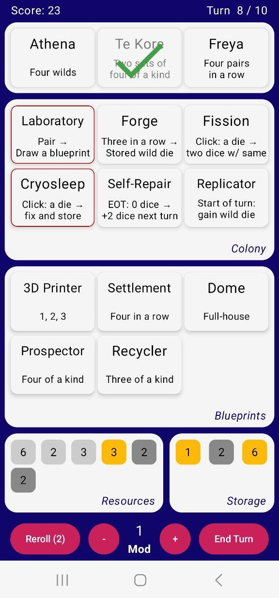

# Pangu Project

This repository reimplements the dice game [PanguProject](https://artless.itch.io/pangu) from Artless Games to make it playable on Android.
Some of the Blueprint names have been changed in order to fit the screen, but the rest should be identical to the original game.

  

# Installation

The app can be installed from the [APK file located at `app/release/app-release.apk`](./app/release/app-release.apk).

# Rules

The objective of the game is to construct three randomly drawn **projects** within a maximum of 10 turns. Each project requires a different combination of dice.

To fund these projects, **blueprints** must be constructed into **buildings**, each providing unique advantages such as additional dice or other effects. Each blueprint can only be utilized once per turn.

At the beginning of each game, two buildings are already established in the colony: the Laboratory and the Forge. Every turn, four base dice are rolled to fund blueprints or projects, and a new blueprint is drawn.

Blueprints can be discarded to earn one MOD point, which can then be used to adjust the value of any die by 1. Additionally, two **rerolls** are permitted per turn to reroll sets of dice. At the end of each turn, all dice are discarded.

When using building effects, different types of dice may be rolled:
- **Fixed dice:** These dice cannot be rerolled unless specified otherwise.
- **Stored dice:** These dice are kept between turns and not discarded.
- **Wild dice:** These dice can be modified to any value without spending MOD points.

Upon completion of all projects or after 10 turns, the game ends and the score is computed as follows:
- Each constructed blueprint earns 1 point.
- Projects constructed on turn `n` earns `3 * (11 - n)` points.

# Controls

Tap on a die to select or deselect it.

Long-press on a die to select it while deselecting all other dice.

Tap on a project or blueprint to build it (the selected dice must match its cost).

Tap on a building to activate its effect (the selected dice must match its cost).

Double-tap on a blueprint to discard it.

Long-press on a project, building, or blueprint to view a detailed description of its cost and effects.

Click the reroll button to reroll all selected dice (excluding fixed and wild dice).

Select a die and click the `-` or `+` button to modify its value (requires MOD points or to modify wild dice).
